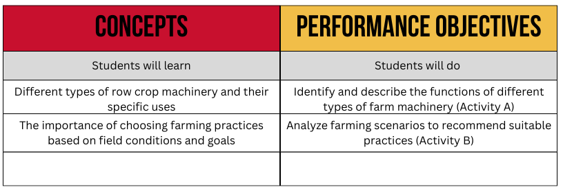

<nav>
  <a href="index.html">Home</a>
  <a href="contact.html">Contact</a>
  <a href="Modules.html">Modules</a>
</nav>

## This is where Module 1 material would be thf

I am pretty sure that we could track when teachers view/download material

## Module 1 - Ag Machinery

- [Module 1 Teacher Notes](Random PDF.pdf)

- [Lesson 1 - Conventional Tillage - Slides](TeacherResources\Unit1CropAndSoilManagement\Module1_Tillage\Lesson1.1.1\1.1.1.pptx)
- [Lesson 1 Student Worksheet](TeacherResources\Unit1CropAndSoilManagement\Module1_Tillage\Lesson1.1.1\StudentWorksheet1.1.1.pdf) 
- [Lesson 1 Student Worksheet Key](TeacherResources\Unit1CropAndSoilManagement\Module1_Tillage\Lesson1.1.1\StudentWorksheet1.1.1Key.pdf) 
