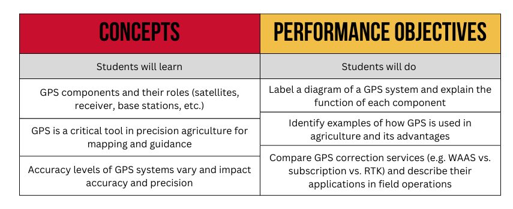

<nav>
  <a href="index.html">Home</a>
  <a href="contact.html">Contact</a>
  <a href="Modules.html">Modules</a>
</nav>

## This is where Module 2 material would be

I am pretty sure that we could track when teachers view/download material

- [Module 2 Teacher Notes](Random PDF.pdf)

- [Lesson 1 Slides](RandomSlides.pdf)
- [Lesson 1 Student Worksheet](Random PDF.pdf) 
- [Lesson 1 Student Worksheet Key](Random PDF.pdf) 

