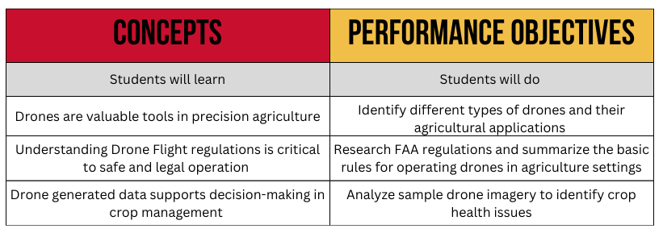

<nav>
  <a href="index.html">Home</a>
  <a href="contact.html">Contact</a>
  <a href="Modules.html">Modules</a>
</nav>

## This is where Module 3 material would be

I am pretty sure that we could track when teachers view/download material

- [Lesson 1 Teacher Notes](Random PDF.pdf)
